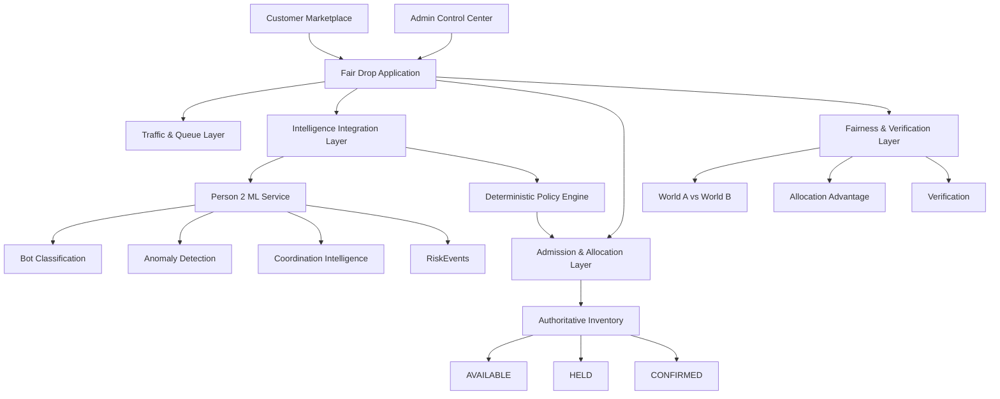
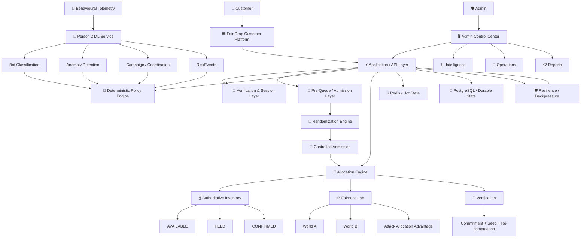
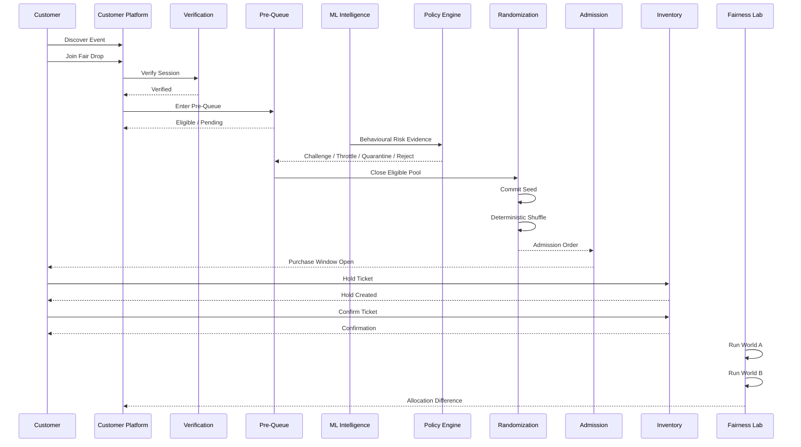
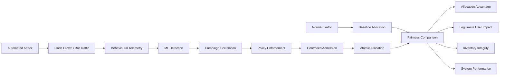
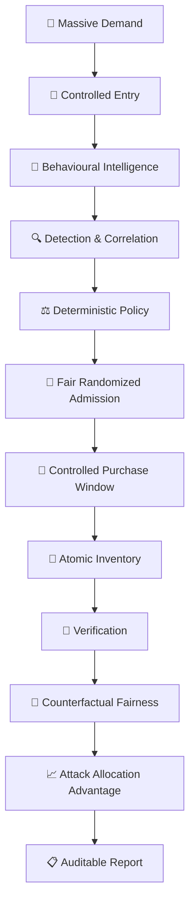

# 🎟️ FAIR DROP

## Selling 500 Seats to 50,000 People Without Letting Bots Win

<p align="center">
  <b>BIT N BUILD — MAHARASHTRA ROUND</b>
  <br/>
  <b>Fr. Conceicao Rodrigues College of Engineering (CRCE)</b>
  <br/><br/>
  <sub>Problem Statement 3 • High-Demand Fair Allocation & Anti-Bot Infrastructure</sub>
</p>

<p align="center">
  
  
  
  
  
  
  
</p>

---

# 🏆 Competition

## BIT N BUILD — MAHARASHTRA ROUND

**Host:** Fr. Conceicao Rodrigues College of Engineering (CRCE)

**Track:** Web / App Development

**Problem Statement:** PS3 — Fair Drop

**Team:** TWOPOINTERS

### Team Members

- **Tejaswee Rajput** — Team Lead
- **Rahul Sharma** — Team Member
- **Sohana Pilli** — Team Member

---

# 🚨 The Problem

High-demand ticket drops create a race that rewards speed, automation and request volume instead of fair participation.

When thousands of users compete for a small number of seats:

- Automated clients can generate thousands of requests.
- Aggressive refreshing can overload infrastructure.
- Multiple sessions can be coordinated.
- Legitimate users can face timeouts and inconsistent state.
- First-come-first-served systems can turn allocation into a race between machines.
- Duplicate requests can create allocation inconsistencies.
- A system may detect attacks without proving whether those attacks actually changed allocation outcomes.

The fundamental question is:

> **How do we sell scarce inventory at extreme demand without allowing automation to gain a significant allocation advantage?**

---

# 💡 Our Solution

**Fair Drop** is a high-demand ticketing and allocation platform designed around one principle:

> **Speed should not determine who gets scarce inventory.**

Fair Drop combines:

- 🎟️ Real ticketing marketplace
- 🛡️ Controlled pre-queue
- 🧠 Behavioural ML intelligence
- 🔍 Anomaly detection
- 🕸️ Coordinated campaign detection
- ⚖️ Deterministic policy enforcement
- 🎲 Verifiable randomized admission
- 🚦 Controlled admission
- 🔐 Identity/session correlation
- 💺 Atomic inventory allocation
- 🧪 Adversarial attack simulation
- 📊 Counterfactual fairness experiments
- 🔎 Allocation verification
- 📋 Incident reporting
- ⚡ Flash-crowd resilience

The platform is deliberately divided into two experiences:

```text
                    FAIR DROP
                       │
          ┌────────────┴────────────┐
          │                         │
          ▼                         ▼
     CUSTOMER SIDE             ADMIN CONTROL
    Ticket Marketplace       Security & Operations
```

---

# 🎯 Core Principle

Fair Drop does not treat bot detection as the final solution.

Instead:

```text
DETECT
   ↓
UNDERSTAND
   ↓
CORRELATE
   ↓
ENFORCE
   ↓
ADMIT FAIRLY
   ↓
ALLOCATE SAFELY
   ↓
VERIFY
   ↓
MEASURE
```

The intelligence layer provides evidence.

The deterministic policy layer decides enforcement.

The allocation layer remains authoritative.

---

# 🛒 Customer Experience

Fair Drop behaves like a real event-ticketing platform rather than exposing internal security infrastructure to customers.

## Customer Journey

```text
DISCOVER EVENTS
      ↓
SELECT EVENT
      ↓
EVENT DETAILS
      ↓
JOIN FAIR DROP
      ↓
VERIFY
      ↓
PRE-QUEUE
      ↓
PRE-QUEUE CLOSES
      ↓
RANDOMIZED ADMISSION
      ↓
WAITING / ADMISSION
      ↓
ADMITTED
      ↓
SELECT TICKET
      ↓
RESERVE / HOLD
      ↓
PAYMENT
      ↓
CONFIRMATION
      ↓
VERIFY ALLOCATION
```

### Customer Marketplace

- Event discovery
- Search
- City selection
- Category filtering
- Event details
- Ticket types
- Pricing
- My Tickets
- Offers
- Secure Fair Drop entry

Supported catalogue categories include:

- Movies
- Concerts
- Sports
- Comedy
- Theatre
- Seminars
- Workshops
- Activities

---

# 🔎 Smart Event Discovery

The customer search system can filter the event catalogue using:

- Event name
- Category
- Venue
- City
- Artist
- Speaker
- Tags

City selection dynamically filters the local event catalogue.

---

# 🚦 Fair Pre-Queue

The pre-queue deliberately separates **arrival time** from **allocation priority**.

Users first enter an eligible pool rather than competing for a ticket purely through request speed.

```text
USER ARRIVES
     ↓
VERIFY
     ↓
PRE-QUEUE
     ↓
ELIGIBILITY
     ↓
POOL CLOSES
     ↓
RANDOMIZATION
```

The customer does not receive a speed-based allocation advantage simply because their browser sent requests faster.

---

# 🎲 Verifiable Randomized Admission

After the eligible pool closes:

```text
ELIGIBLE USER POOL
        ↓
COMMITMENT
        ↓
SERVER-CONTROLLED SEED
        ↓
DETERMINISTIC SHUFFLE
        ↓
RANDOMIZED ORDER
        ↓
CONTROLLED ADMISSION
```

This creates an admission order that can be independently reconstructed and verified.

---

# 🧠 Intelligence Layer

Fair Drop integrates a dedicated ML intelligence layer that analyses behavioural evidence.

The ML layer can produce:

- Bot probability
- Anomaly score
- Behavioural classification
- Coordination score
- Campaign ID
- Attack type
- Session intelligence
- Evidence
- Model version

The intelligence layer is **advisory**.

It does not directly control inventory.

```text
USER / SESSION
      ↓
BEHAVIOURAL FEATURES
      ↓
BOT CLASSIFICATION
      ↓
ANOMALY DETECTION
      ↓
COORDINATION ANALYSIS
      ↓
RISK / EVIDENCE
      ↓
DETERMINISTIC POLICY
```

---

# 🛡️ Deterministic Policy Enforcement

ML should not directly decide who receives a seat.

Fair Drop separates intelligence from enforcement:

```text
                    ML INTELLIGENCE
                          │
             ┌────────────┴────────────┐
             │                         │
        Risk Evidence            Behaviour Evidence
             │                         │
             └────────────┬────────────┘
                          ↓
                 POLICY ENGINE
                          │
        ┌─────────────────┼─────────────────┐
        ↓                 ↓                 ↓
     NORMAL           CHALLENGE          HIGH RISK
        │                 │                 │
        │              PASS/FAIL       THROTTLE
        │                                 ↓
        │                            QUARANTINE
        │                                 ↓
        └────────────────────────────── REJECT
```

This prevents an ML prediction from directly mutating inventory state.

---

# 🕸️ Coordinated Bot Intelligence

Fair Drop does not only look for isolated suspicious users.

It can correlate:

- Sessions
- Accounts
- Tokens
- Behaviour patterns
- Request timing
- Synchronization
- Campaign relationships

The objective is to identify coordinated behaviour rather than treating every suspicious request independently.

---

# ⚔️ Adversarial Attack Lab

Fair Drop can demonstrate its defence pipeline against configurable attack behaviour.

Attack scenarios can include:

- Request flooding
- Aggressive refreshing
- Parallel requests
- Multi-session behaviour
- Distributed automated traffic
- Low-and-slow behaviour
- Coordinated campaigns

The attack is injected into the simulated environment and its impact is measured.

```text
ATTACK
  ↓
TRAFFIC SURGE
  ↓
BEHAVIOURAL SIGNALS
  ↓
ML DETECTION
  ↓
CAMPAIGN CORRELATION
  ↓
POLICY ACTION
  ↓
MITIGATION
  ↓
FAIRNESS MEASUREMENT
```

---

# 💺 Atomic Ticket Allocation

Inventory follows explicit transactional states:

```text
AVAILABLE
    │
    ▼
  HELD
    │
    ▼
CONFIRMED
```

Alternative expiry path:

```text
HELD
  │
  └── TIMEOUT / RELEASE
          ↓
      AVAILABLE
```

The allocation layer protects against:

- Duplicate allocation
- Overselling
- Race conditions
- Repeated requests
- Expired reservations
- Idempotency conflicts
- Inconsistent inventory state

---

# 🔐 Idempotent Allocation

Repeated requests must not create repeated allocations.

The allocation layer uses idempotency protection so that retrying a request does not accidentally create additional inventory claims.

```text
REQUEST
   ↓
IDEMPOTENCY CHECK
   ↓
VALID REQUEST?
   ├── NO → REJECT / CONFLICT
   │
   └── YES
         ↓
     ATOMIC CLAIM
         ↓
       HOLD
         ↓
     CONFIRM / RELEASE
```

---

# ⚖️ Fairness Lab

Fair Drop does not stop at saying:

> "The bot was detected."

It measures whether the attack actually changed outcomes.

Two controlled worlds are compared:

```text
WORLD A
Legitimate Traffic
      │
      ▼
Allocation Outcome


WORLD B
Same Legitimate Traffic
        +
Adversarial Traffic
        │
        ▼
Allocation Outcome
```

The comparison measures:

- Legitimate allocation
- Automated allocation
- Allocation gap
- Attack Allocation Advantage
- Queue distortion
- Inventory impact
- Overselling
- System performance

---

# 📈 Attack Allocation Advantage

The system quantifies whether adversarial traffic gained disproportionate access to scarce inventory.

```text
ATTACKER SHARE OF USERS
          │
          ▼
ATTACKER SHARE OF SEATS
          │
          ▼
ALLOCATION GAP
          │
          ▼
ATTACK ALLOCATION ADVANTAGE
```

This transforms fairness from a claim into a measurable outcome.

---

# 🔎 Allocation Verification

Fair Drop provides a verification layer around the randomized allocation process.

```text
COMMITMENT
    ↓
REVEALED SEED
    ↓
RECONSTRUCT ORDER
    ↓
RECOMPUTE ALLOCATION
    ↓
COMPARE RESULT
    ↓
VERIFIED / INVALID
```

The current verification mechanism provides an auditable commitment/hash-based proof and does not claim to be an external randomness beacon.

---

# 🖥️ Admin Control Center

The customer marketplace and security infrastructure are deliberately separated.

The Admin portal provides the operational view of the complete drop.

## Admin Navigation

```text
OVERVIEW
   │
TRAFFIC
   ├── Live Traffic
   ├── Queue
   └── Load Lab
   │
INTELLIGENCE
   ├── Detection
   ├── Campaigns
   ├── Attack Lab
   └── Risk Signals
   │
ADMISSION
   ├── Pre-Queue
   ├── Randomization
   ├── Admission
   └── Allocations
   │
FAIRNESS
   ├── Fairness Lab
   ├── Allocation Advantage
   └── Verification
   │
OPERATIONS
   ├── Incidents
   ├── System Health
   └── Reports
```

---

# 📊 Admin Overview

The overview provides the operational state of the active drop:

- Participants
- Requests/sec
- Queue depth
- Active sessions
- Human traffic
- Suspicious traffic
- Bot traffic
- Seats remaining
- Admitted users
- Holds
- Confirmations
- Latency
- System health
- Inventory integrity
- Recent incidents

---

# 🌐 Live Traffic

The traffic console exposes:

- Requests/sec
- Active sessions
- Queue depth
- p50/p95/p99 latency
- Traffic composition
- Load
- Shed traffic
- Admission rate
- Queue bypass attempts
- Mitigation events

---

# 🧠 Intelligence Console

The Intelligence console surfaces:

- ML service status
- Model version
- Risk scores
- Anomaly scores
- Coordination scores
- Campaigns
- Suspicious sessions
- Evidence
- Policy decisions
- Detection metrics
- False positives
- Recent RiskEvents

---

# 🕸️ Campaign Intelligence

Campaign views expose relationships between suspicious sessions and coordinated behaviour.

```text
SESSION A ─────┐
               │
SESSION B ─────┼──→ CAMPAIGN
               │
SESSION C ─────┤
               │
SESSION D ─────┘
```

Each campaign can be inspected through:

- Campaign ID
- Sessions
- Attack type
- Coordination score
- Evidence
- Timeline

---

# 🚨 Incident Management

Incidents connect the complete operational lifecycle:

```text
ATTACK
  ↓
DETECTION
  ↓
CORRELATION
  ↓
POLICY
  ↓
MITIGATION
  ↓
ALLOCATION IMPACT
  ↓
RECOVERY
  ↓
REPORT
```

---

# 📋 Deterministic Reporting

Reports are generated from structured telemetry and recorded system state.

They summarize:

- Drop configuration
- Traffic
- Attacks
- Detection
- Mitigation
- Allocation
- Inventory integrity
- Fairness
- Verification
- Incident outcome

The reporting layer does not fabricate operational truth using an LLM.

---

# 🧪 Simulation Architecture

The project provides a dedicated integration boundary for teammate simulation and ML services.



---

# 🏗️ Overall System Architecture



---

# 🔄 End-to-End Fair Drop Flow



---

# 🧪 Adversarial Evaluation Flow



---

# 🔐 Security & Secrets

For local/demo deployment, the following shared secrets are used:

```env
# ---- shared secrets ----
POSTGRES_PASSWORD=fairdrop123
HMAC_SECRET=fairdrop-hmac-secret-2026-fairdrop
ADMIN_API_KEY=admin-demo-key-2026
INTEGRATION_API_KEY=integration-demo-key-2026
FAIRDROP_COOKIE_SECRET=fairdrop-cookie-secret-2026
FAIRDROP_ADMIN_PASSWORD=FairDrop@2026

ML_SYNC_INTERVAL_SECONDS=0
```

> **Important:** These values are demo/development credentials. Production deployments must replace them with securely generated secrets and environment-specific configuration.

---

# 👨‍💼 Admin Login

The Admin portal is protected separately from the customer marketplace.

### Demo Credentials

```text
Email:
admin@fairdrop.demo

Password:
FairDrop@2026
```

Access through:

```text
Customer Navbar
      ↓
☰ Menu
      ↓
ADMIN ACCESS
      ↓
/admin/login
      ↓
Admin Control Center
```

---

# 🧩 Person 2 ML Integration

Person 2's ML system is exposed as an independent intelligence service.

```text
Fair Drop Admin
      ↓
ML Integration Layer
      ↓
Person 2 ML API
      ↓
┌─────────────────────────┐
│ Bot Classification      │
│ Anomaly Detection       │
│ Coordination Analysis   │
│ Risk Events             │
└─────────────────────────┘
```

Typical ML service endpoints:

```text
GET  /
GET  /ml/summary
GET  /ml/simulation
GET  /ml/risk-events
GET  /ml/session/{session_id}
GET  /ml/risk-event/{event_id}
GET  /ml/live
POST /ml/live/reset
GET  /ml/live-risk-event
POST /ml/live-risk-event/reset
GET  /ml/demo
```

The ML service is intentionally decoupled from authoritative inventory.

---

# 🧱 Project Architecture

```text
fair-drop/
│
├── app/
│   ├── admin/
│   │   ├── login/
│   │   ├── traffic/
│   │   ├── intelligence/
│   │   ├── campaigns/
│   │   ├── attacks/
│   │   ├── admission/
│   │   ├── allocations/
│   │   ├── fairness/
│   │   ├── verification/
│   │   ├── incidents/
│   │   ├── system/
│   │   ├── reports/
│   │   ├── settings/
│   │   └── simulation/
│   │
│   └── customer/
│
├── components/
│   ├── customer/
│   ├── admin/
│   ├── simulation/
│   └── ui/
│
├── lib/
│   ├── engine/
│   ├── ml/
│   ├── fairness/
│   ├── genai/
│   ├── runtime/
│   └── services/
│
├── backend/
│   ├── API
│   ├── allocation
│   ├── inventory
│   ├── queue
│   ├── sessions
│   └── resilience
│
├── tests/
│
├── public/
│
├── middleware.ts
├── package.json
└── README.md
```

---

# 🛠️ Technology Stack

## Frontend

- Next.js
- React
- TypeScript
- Tailwind CSS
- shadcn/ui
- Framer Motion
- Recharts
- Lucide React

## Backend

- Python
- FastAPI
- PostgreSQL
- Redis
- WebSockets / Server-Sent Events

## AI / ML

- Python
- scikit-learn
- XGBoost
- Isolation Forest
- NetworkX
- Behavioural feature extraction
- Risk scoring
- Anomaly detection
- Campaign correlation

## Security

- HMAC
- Signed queue tokens
- Server-side validation
- Idempotency keys
- Session validation
- Protected admin authentication

## Testing / Simulation

- Python
- asyncio
- Locust
- Configurable adversarial clients
- Counterfactual experiments
- Fairness metrics

---

# 🚀 Getting Started

## Prerequisites

Make sure the following are installed:

- Node.js
- npm
- Python 3.11+
- PostgreSQL
- Redis

---

## 1. Clone the Repository

```bash
git clone <YOUR_REPOSITORY_URL>
cd fair-drop
```

---

## 2. Install Frontend Dependencies

```bash
npm install
```

---

## 3. Install Backend Dependencies

```bash
pip install -r backend/requirements.txt
```

---

## 4. Configure Environment Variables

Create `.env` / `.env.local` using the required development secrets:

```env
POSTGRES_PASSWORD=fairdrop123
HMAC_SECRET=fairdrop-hmac-secret-2026-fairdrop
ADMIN_API_KEY=admin-demo-key-2026
INTEGRATION_API_KEY=integration-demo-key-2026
FAIRDROP_COOKIE_SECRET=fairdrop-cookie-secret-2026
FAIRDROP_ADMIN_PASSWORD=FairDrop@2026

ML_SYNC_INTERVAL_SECONDS=0
```

---

## 5. Start PostgreSQL

Ensure PostgreSQL is running on the configured development environment.

---

## 6. Start Redis

Ensure Redis is running and available to the Fair Drop backend.

---

## 7. Start the Backend

```bash
uvicorn backend.main:app --reload --port 8000
```

Backend:

```text
http://localhost:8000
```

---

## 8. Start the ML Service

From the Person 2 ML integration package:

```bash
uvicorn ml_api.main:app --reload --port 8001
```

ML API:

```text
http://localhost:8001
```

---

## 9. Start the Frontend

```bash
npm run dev
```

Frontend:

```text
http://localhost:3000
```

---

# ▶️ Demo Workflow

```text
1. Open Fair Drop
        ↓
2. Browse Events
        ↓
3. Select High-Demand Event
        ↓
4. Join Fair Drop
        ↓
5. Verify
        ↓
6. Enter Pre-Queue
        ↓
7. Launch Adversarial Attack
        ↓
8. Observe ML Detection
        ↓
9. Observe Campaign Correlation
        ↓
10. Observe Policy Enforcement
        ↓
11. Close Pre-Queue
        ↓
12. Commit Randomization
        ↓
13. Generate Admission Order
        ↓
14. Admit Users
        ↓
15. Hold Ticket
        ↓
16. Confirm Ticket
        ↓
17. Verify Allocation
        ↓
18. Open Fairness Lab
        ↓
19. Compare World A vs World B
        ↓
20. Measure Attack Allocation Advantage
        ↓
21. Generate Incident / Drop Report
```

---

# 🏆 What Makes Fair Drop Different?

Most anti-bot systems stop at:

```text
BOT DETECTED
```

Fair Drop goes further:

```text
BOT DETECTED
      ↓
WHY?
      ↓
WHAT SHOULD HAPPEN?
      ↓
DID MITIGATION WORK?
      ↓
DID LEGITIMATE USERS REMAIN PROTECTED?
      ↓
DID THE ATTACK CHANGE ALLOCATION?
      ↓
CAN THE RESULT BE VERIFIED?
```

The core differentiator is not simply detection.

It is **measurable fairness under adversarial demand**.

---

# 📊 Fair Drop's Core Engineering Loop



---

# 🎯 Final Vision

Fair Drop transforms high-demand ticket drops from a race of:

> **Who can send requests fastest?**

into a system based on:

> **Who is eligible, what evidence exists, how should access be controlled, and can the final allocation be proven fair?**

```text
DETECT
   ↓
PROTECT
   ↓
ADMIT
   ↓
ALLOCATE
   ↓
VERIFY
   ↓
MEASURE
```

## **FAIR DROP**

### **Don't just detect the bots.**
### **Make speed irrelevant.**
### **Prove the drop was fair.**

---

<p align="center">
  <b>Built by Team TWOPOINTERS</b>
  <br/>
  Tejaswee Rajput • Rahul Sharma • Sohana Pilli
  <br/><br/>
  <b>BIT N BUILD — MAHARASHTRA ROUND</b>
  <br/>
  Fr. Conceicao Rodrigues College of Engineering (CRCE)
</p>
